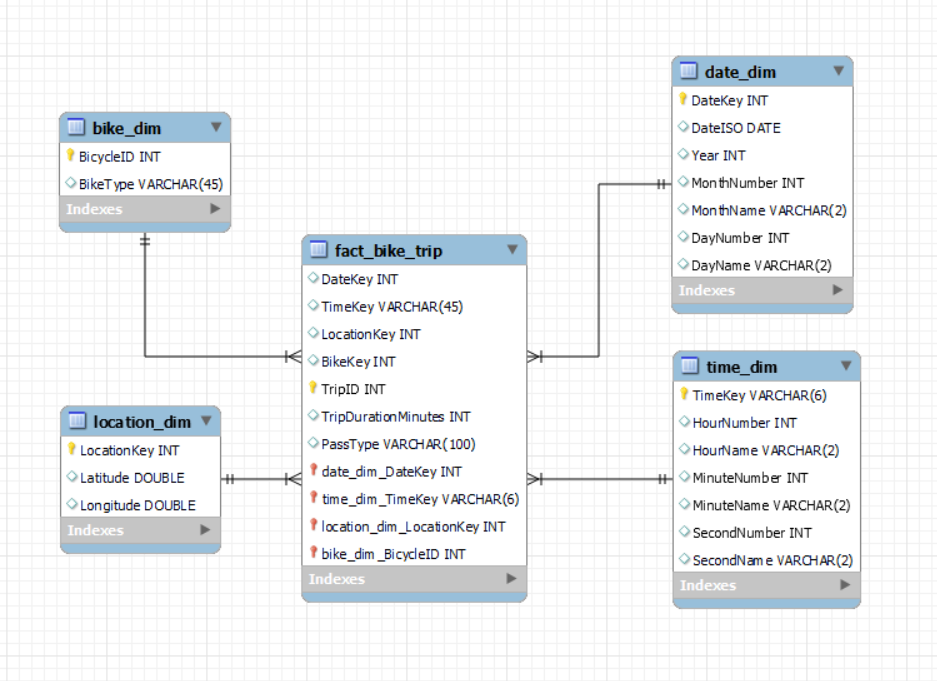
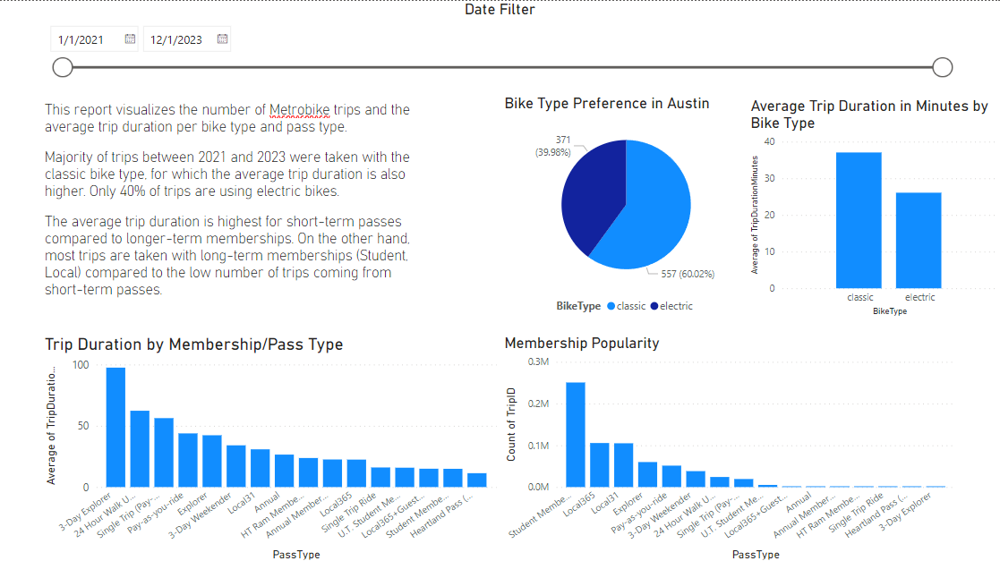
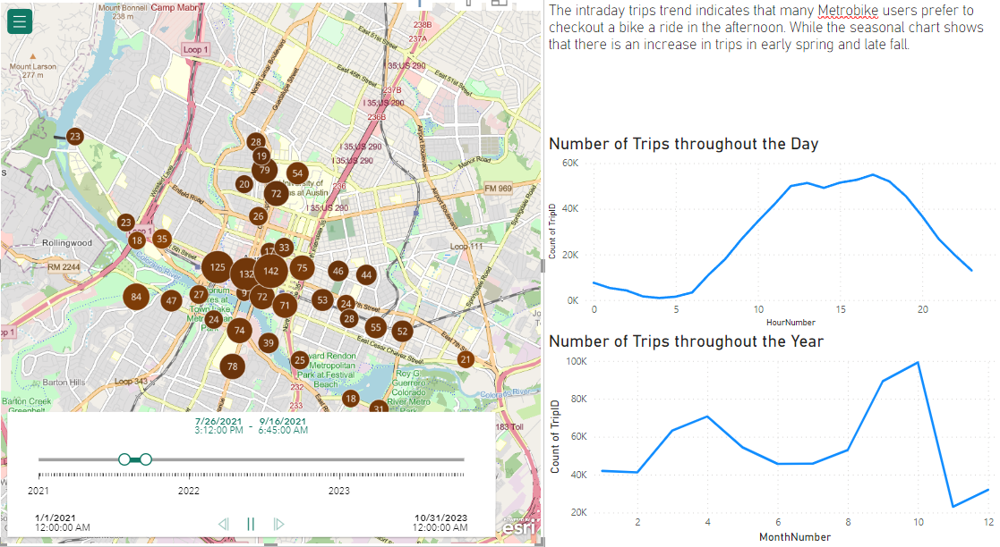

# Austin MetroBike Trips ELT

## ELT Tools Used:
* Azure Data Store for Staging
* Databricks SQL Warehouse
* Databricks Workspace Pyspark Notebook
## Other Tools
* MySQL Workbench for Dimensional Modeling
* Power BI for Visualization

##

## Potential Business Use Cases: 
* Predictive system on time of arrival given the traffic congestion.
* Same predictive system given the weather forecast
* Programmatic advertising strategy based on the 

##

## Extract and Load
After extracting ~1.1GB of data as csv files, the traditional ETL process did not work. So for this amount of data I decided to use ELT process.

The raw data was uploaded to Azure blob for staging. Then I configured my SQL Warehouse and created the schema using Databricks SQL Editor, where I added the raw data files afterwards.

Alternative tools to consider for future projects for data ingestion: FiveTran or Stitch

##

## Dimensional Model

#### Tools used: MySQL Workbench
The SQL schema will inform the transformations we will need to do for our raw data.

## Transforming the Data
Here, I decided to proceed with Pyspark due to my prior knowledge of this tool from my Big Data Technologies course.

The notebook is uploaded to this repository. In a nutshell, I created new dimension tables (date, time, location), extracted the bike dimension,
kept columns in the fact table that aligned with the dimensional model, removed missing values and adjusted the datatypes

##

## Insights

Austin BCycle provides a bike share service called MetroBike and offers a variety of passes and memberships to make the most out of this service.

The Explorer pass provides unlimited 60-minute rides during 1-3 day period. Monthly and annual passes are available 
through the Local pass type. The pay-as-you-ride pass allows for low-commitment, fun rides, while student memberships 
are offered at a discounted rate.

Knowing that a significant number of trips come from the Student Membership, 
BCycle can utilize this to tailor their ride-sharing products to their different customer segments and 
increase ad impressions during certain hours, while preparing promotions in months with lower trip number 
to increase their revenue.

##
## Next Steps:
* Making the data more robust - adding past weather forecasts, and traffic congestion dataset.
* Machine Learning! With the Spark dataframe, we can set the metrics for the model, split the data and start training and evaluating models to predict trip duration.
* Building a Predictive System for Bike Sharing Services (not only for Austin, TX, but nationwide)

#
# Thank you!